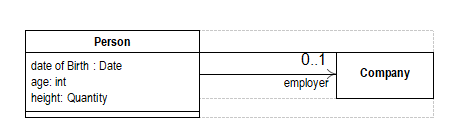

# Dealing with Properties
---
*Martin Fowler*   <P>
fowler@acm.org
---
- 几乎你创建的每个对象都需要属性：关于对象的一些声明。一个人可能有一个高度，一个公司可能有一个CEO，一个航班可能有一个航班号。有很多方法来建模属性。在这篇文章中，我将探讨
其中一些方法，当你可能想要使用它们。我经常看到图案触及这个主题，但他们通常只涉及部分图片。在这里，我想更广泛地讨论这个问题，以便更好地讨论这些选项。

- 最常见和最简单的情况是使用固定属性，即只声明类的属性。在绝大多数情况下，你只需要做。固定属性在有大量固定属性时会失败，或者需要频繁更改，可能在运行时。这些力量带领您到各种各样的动态财产。所有动态属性都具有参数化属性的质量，在这里查询需要使用带有参数的查询方法的属性。其中最简单的是灵活的动态属性，其中参数只是一个字符串。这使得定义和使用属性变得容易，但难以控制。如果您需要该控件，则可以使用“定义的动态属性”，其中参数必须是某个类的实例。进一步的控制步骤允许您强有力地键入您的动态属性与类型动态属性。

- 随着您的财产结构变得越来越复杂，您应该考虑将它们设置为“单独属性”，从而使属性成为一个对象。如果你需要多值属性，你可以考虑一个类型化的关系。在这个主题中最复杂的例子是你想要规则来控制什么类型的对象具有什么样的属性 - 这需要动态属性知识水平。

- 另一种属性完全是外部属性（Extrinsic Property），如果你想给一个对象一个属性，但是不改变它的接口来支持它，那么就是你使用的一种模式。

Problem	|Solution	|Name	|page
--- | --- | --- | ---
 &nbsp;  |给它一个这个事实的特定属性。这将转化为查询方法，并可能是一种编程语言的更新方法.|固定属性|4
 &nbsp;  |提供可参数化的属性，可以根据参数表示不同的属性|动态属性|4
 &nbsp;  |提供一个用字符串参数化的属性。声明一个属性只是使用字符串.|灵活的动态属性|5
 &nbsp;  |提供用某种类型的实例参数化的属性。要声明属性，请创建该类型的新实例|定义的动态属性|7
 &nbsp;  |提供使用某种类型的实例进行参数化的属性。要声明属性，请创建该类型的新实例并指定该属性的值类型.|类型动态属性|9
你如何代表一个事物的事实，并允许事实记录有关的事实|为每个属性创建一个单独的对象。 关于那个财产的事实可以作为这个财产的属性|分开的属性	|10
你如何表示两个对象之间的关系（如何表示多值动态属性？）|为两个对象之间的每个链接创建一个关系对象。 给关系对象一个类型对象来表示关系的含义。 （类型对象是多值属性的名称。）|类型关系| 14
当你使用动态属性时，你如何强制某些类型的对象具有某些属性？ |创建知识级别以包含哪些类型的对象使用哪些类型的属性|的规则 动态财产知识水平| 16
你如何给一个对象一个属性而不改变它的接口？|使另一个对象负责知道属性| 外在性质| 18

---
## 什么是属性
- 这不是一个愚蠢的问题。当人们围绕“属性”这个词来分支时，他们可能意味着很多不同的东西。对某些属性来说，是一个类的实例变量或数据成员。对于其他人来说，它们就像UML图中的一个盒子一样。所以在我开始这篇文章之前，我必须定义这个词的用法。

- 为了我的目的，一个属性是关于一个可以通过查询方法获得的对象的一些信息。它可能是一个值类型（如Java中的int）或一个类的实例。您可能能够更新该属性，但不一定。您可以在创建对象时设置属性，但不一定。该属性可以作为实例变量或数据成员存储，但不一定是。班级可能会从另一个班级获得价值，或者经过一些进一步的计算。因此，我采用属性的接口视图而不是实现视图。这是我在设计中经常使用的习惯：对于我来说，面向对象的本质是将接口与实现分开，并使接口更加重要。
---

## 固定属性
- 固定属性是我们使用的最常见的属性。 固定属性在类型的接口中声明。 它给出了属性的名称和返回类型。 图1显示了使用UML建模的属性，清单1显示了这些属性的查询方法如何在Java中显示。 我已经选择了这个例子来说明这个讨论同样适用于UML属性和UML关联。 它也适用于计算值（年龄）以及那些合理存储的数据（出生日期）。


> 图1.使用固定属性建模的人员
```java
class Person {
public Date getDateOfBirth(); 
public int getAge();
public Quantity getHeight(); 
public Company getEmployer();
public void setDateOfBirth (Date newDateOfBirth); 
public void setEmployer (Company newEmployer);
```
> 列举,图1的`java`操作

- 查询操作通常遵循一些命名约定。在smalltalk中，您总是在属性名称（dateOfBirth）之后命名查询。 C ++从来没有一个固定的约定，有些人只是在属性后面命名，而另一些人则使用“get”约定（getDateOfBirth）。 Java从没有特别的约定开始，但现在大多数人都采用get约定。就我个人而言，当您阅读代码时，我发现“get”令人恼火，所以我宁愿忽略它，但Java风格是使用get，所以现在就使用它。无论您使用的是存储值还是派生值，都应确保遵循相同的约定。人类的客户不应该知道或关心年龄是否存储或派生。

- 修饰符操作的存在取决于您是否希望直接修改值。如果你这样做，那么你会根据一些命名方案，例如setDateOfBirth（Date）提供一个修饰符操作。对于返回值存在不同的约定。你可以返回属性的新值（Date），被修改的对象（Person），或者什么都没有（void）。我更愿意在修饰符上返回void，以帮助明确修饰符和查询之间的区别。

```
  固定属性
 你如何代表一个对象的事实？给它一个这个事实的特定属性。 这将转化为查询方法，并可能是一种编程语言的更新方法。 </br>
  ✓清晰的界面
 （只能在设计时添加属性
```